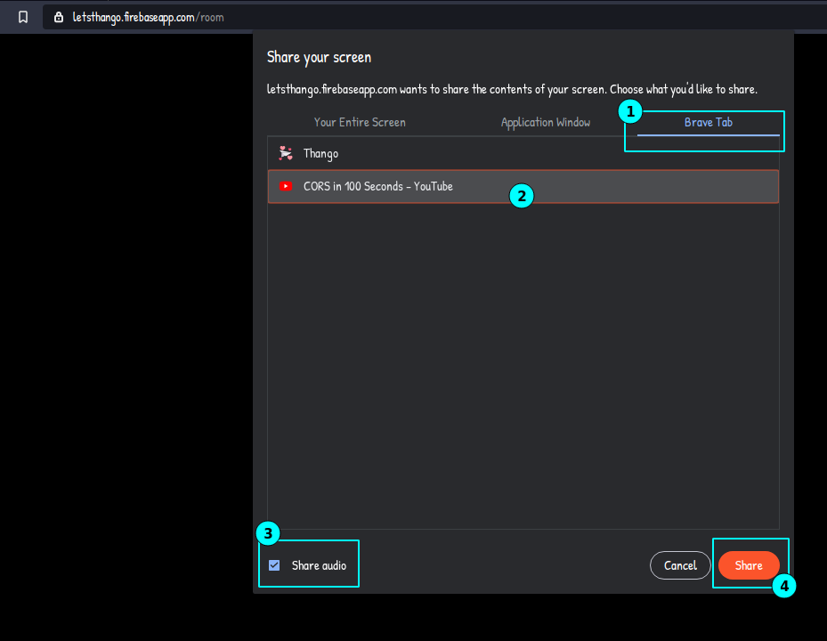

# Longmeet - Let's Thango 

A web application that leverages pure WebRTC protocol, Google Firestore as a signaling server, and Chromium Tab sharing protocol to allow screen sharing with audio, which enables the ability for folks to catch up and enjoy music and videos together despite the distance.

  <a href="https://letsthango.web.app" target="_blank">Application</a>   

# Motivation
I'm currently in a long-distance relationship myself and have been for the past three years. I understand the longing desire to watch and share experiences with your partner, and how most platforms out there are not dedicated to this need while allowing video conversation simultaneously. I am setting out to solve the problem once and for all, hence the creation of Let's Thango.

# Features
- Sharing the screen with audio using Chromium-based browsers.     
     

- Enjoy video at 60fps along with high-quality audio.   
- Live Video Chat between parties.     
- Audio Only Chat between parties.       

# To Run this Locally
- use "npm install" in project directory
- Setup Firebase in the Shared / Index.ts file
- then hit "npm start"

# Instruction
1. The flow is relatively straightforward. One user can create the call by clicking *Create Call*, then proceed to share the Call ID by clicking on the Location pin, which will copy the ID to their clipboard. 
2. The other users can join the call by entering the Call ID and hitting *Join Call*.
3. And that's it, share your tab and enjoy the show.

# Limitation
This project is built using pure WebRTC with no forwarding server in the middle, so as users per room cross the threshold of 3 people, the stream's quality will start to decline.

# Future goals
Add a forwarding server using technologies such as 'mediasoup' to host bigger rooms.
